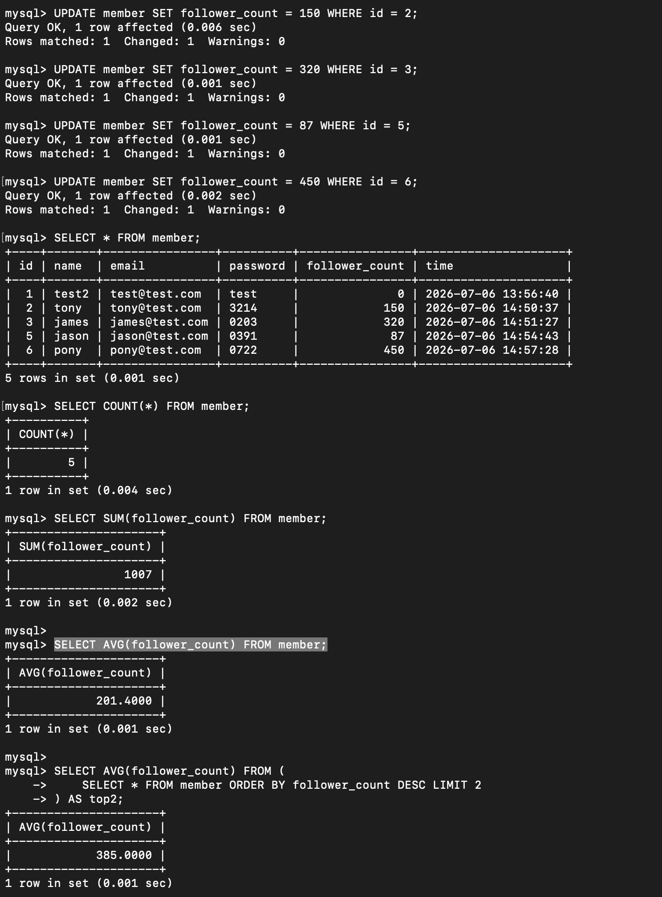
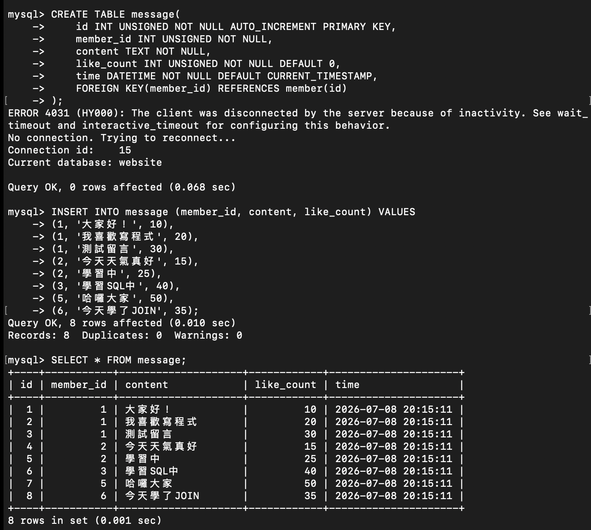
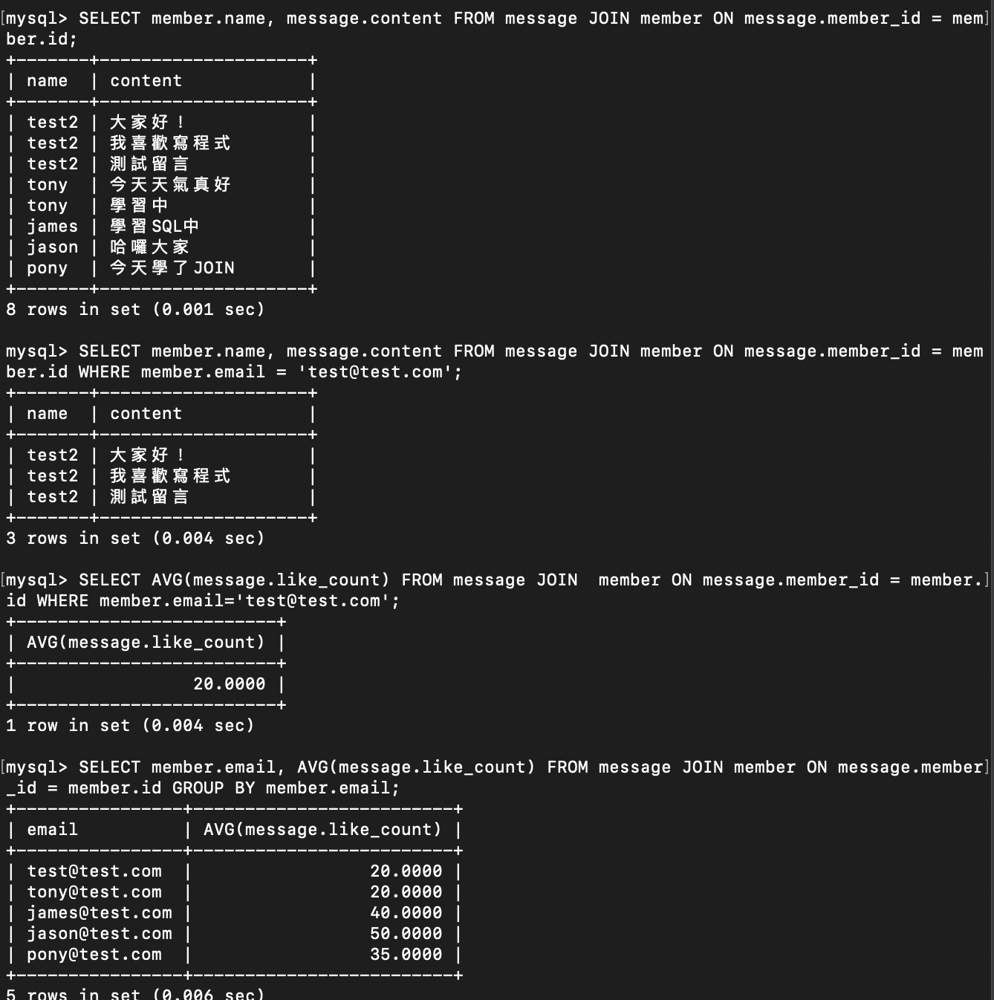

## Task 2: Create database and table

### 建立 website 資料庫、member 資料表

```sql
CREATE DATABASE website;
USE website;
CREATE TABLE member (
    id INT UNSIGNED NOT NULL AUTO_INCREMENT PRIMARY KEY,
    name VARCHAR(255) NOT NULL,
    email VARCHAR(255) NOT NULL,
    password VARCHAR(255) NOT NULL,
    follower_count INT UNSIGNED NOT NULL DEFAULT 0,
    time DATETIME NOT NULL DEFAULT CURRENT_TIMESTAMP
);

```


## Task 3: SQL CRUD

### INSERT 資料
```sql
INSERT INTO member (name, email, password) VALUES ('test', 'test@test.com', 'test');
INSERT INTO member (name, email, password) VALUES ('tony', 'tony@test.com', '3214');
INSERT INTO member (name, email, password) VALUES ('james', 'james@test.com', '0203');
INSERT INTO member (name, email, password) VALUES ('jason', 'jason@test.com', '0391');
INSERT INTO member (name, email, password) VALUES ('pony', 'pony@test.com', '0722');
```


### 篩選排序與更新資料表的資料

```sql
SELECT * FROM member;
SELECT * FROM member ORDER BY time DESC;
SELECT * FROM member ORDER BY time DESC LIMIT 3 OFFSET 1;
SELECT * FROM member WHERE email='test@test.com';
SELECT * FROM member WHERE name LIKE '%es%';
SELECT * FROM member WHERE email='test@test.com' and password='test';
UPDATE member SET  name='test2' WHERE email='test@test.com';
```


## Task 4: SQL Aggregation Functions

### 先修改資料表的資料再使用聚合函式（原先都是預設值0）
```sql
UPDATE member SET follower_count = 150 WHERE id = 2;
UPDATE member SET follower_count = 320 WHERE id = 3;
UPDATE member SET follower_count = 87 WHERE id = 5;
UPDATE member SET follower_count = 450 WHERE id = 6;
SELECT COUNT(*) FROM member;
SELECT SUM(follower_count) FROM member;
SELECT AVG(follower_count) FROM member;
SELECT AVG(follower_count) FROM (
    SELECT * FROM member ORDER BY follower_count DESC LIMIT 2
) AS top2;
```


## Task 5: SQL JOIN

### 建立資料表 message 、 新增資料 、 合併資料表
```sql
CREATE TABLE message(
    id INT UNSIGNED NOT NULL AUTO_INCREMENT PRIMARY KEY,
    member_id INT UNSIGNED NOT NULL,
    content TEXT NOT NULL,
    like_count INT UNSIGNED NOT NULL DEFAULT 0,
    time DATETIME NOT NULL DEFAULT CURRENT_TIMESTAMP,
    FOREIGN KEY(member_id) REFERENCES member(id)
);
INSERT INTO message (member_id, content, like_count) VALUES 
(1, '大家好！', 10),
(1, '我喜歡寫程式', 20),
(1, '測試留言', 30),
(2, '今天天氣真好', 15),
(2, '學習中', 25),
(3, '學習SQL中', 40),
(5, '哈囉大家', 50),
(6, '今天學了JOIN', 35);

SELECT member.name, message.content FROM message JOIN member ON message.member_id = member.id;
SELECT member.name, message.content FROM message JOIN member ON message.member_id = member.id WHERE member.email = 'test@test.com';
SELECT AVG(message.like_count) FROM message JOIN  member ON message.member_id = member.id WHERE member.email='test@test.com';
SELECT member.email, AVG(message.like_count) FROM message JOIN member ON message.member_id = member.id GROUP BY member.email;
```

