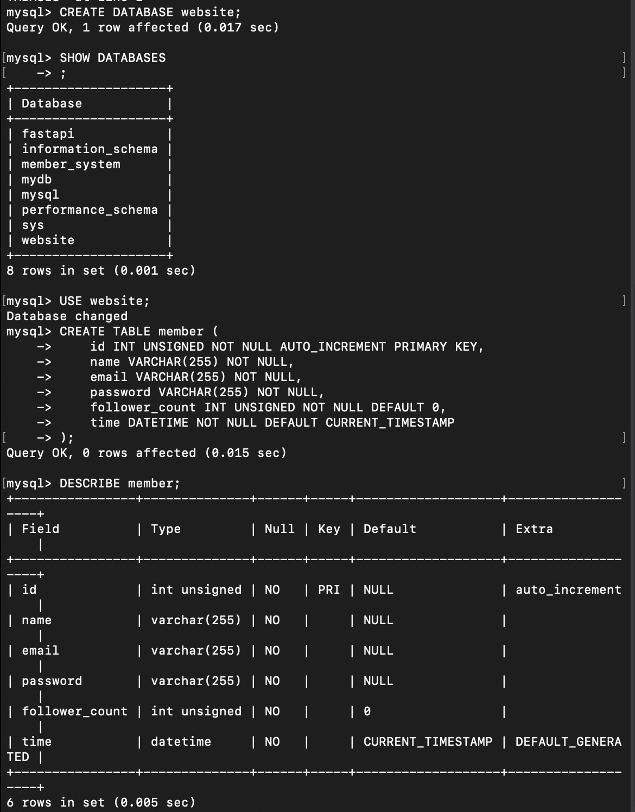
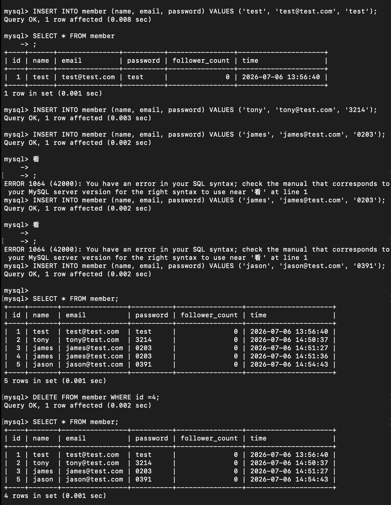
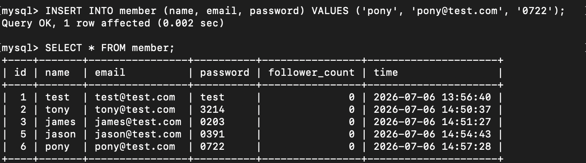
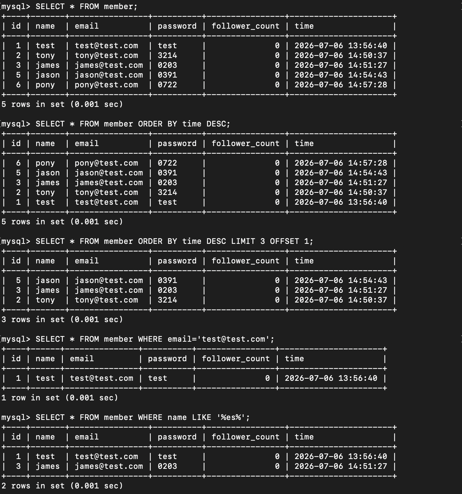
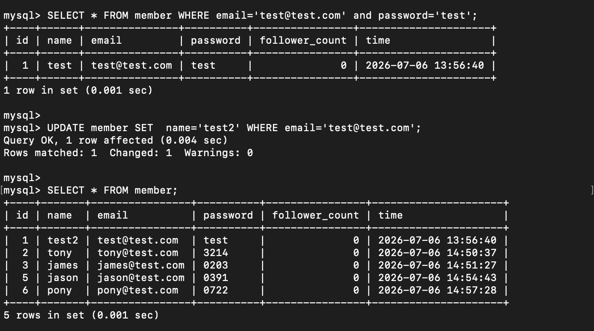

## Task 2: Create database and table

### 建立 website 資料庫、member 資料表

```sql
CREATE DATABASE website;
USE website;
CREATE TABLE member (
    id INT UNSIGNED NOT NULL AUTO_INCREMENT PRIMARY KEY,
    name VARCHAR(255) NOT NULL,
    email VARCHAR(255) NOT NULL,
    password VARCHAR(255) NOT NULL,
    follower_count INT UNSIGNED NOT NULL DEFAULT 0,
    time DATETIME NOT NULL DEFAULT CURRENT_TIMESTAMP
);

```


## Task 3: SQL CRUD

### INSERT 資料
```sql
INSERT INTO member (name, email, password) VALUES ('test', 'test@test.com', 'test');
INSERT INTO member (name, email, password) VALUES ('tony', 'tony@test.com', '3214');
INSERT INTO member (name, email, password) VALUES ('james', 'james@test.com', '0203');
INSERT INTO member (name, email, password) VALUES ('jason', 'jason@test.com', '0391');
INSERT INTO member (name, email, password) VALUES ('pony', 'pony@test.com', '0722');
```



### 篩選排序與更新資料表的資料

```sql
SELECT * FROM member;
SELECT * FROM member ORDER BY time DESC;
SELECT * FROM member ORDER BY time DESC LIMIT 3 OFFSET 1;
SELECT * FROM member WHERE email='test@test.com';
SELECT * FROM member WHERE name LIKE '%es%';
SELECT * FROM member WHERE email='test@test.com' and password='test';
UPDATE member SET  name='test2' WHERE email='test@test.com';
```

